[](https://opensource.org/licenses/GPL-3)


# Bobcat - Terminal Emulator

Bobcat is a modern, feature-rich terminal emulator that works across all major operating systems. It's built using the [U++](https://www.ultimatepp.org/index.html) framework and [TerminalCtrl](https://github.com/ismail-yilmaz/Terminal) widget to create a powerful yet user-friendly command-line experience.

## Table of Contents

1. [Features](#features)
2. [Requirements](#requirements)
3. [Installation](#installation)
4. [ToDo](#todo)
5. [Screenshots](#screenshots)
6. [Videos](#videos)
7. [Acknowledgements](#acknowledgements)
8. [License](#license)

## Features

*For complete VT feature details, see TerminalCtrl's [features](https://github.com/ismail-yilmaz/Terminal#features) list and technical specs [document](https://github.com/ismail-yilmaz/Terminal/blob/master/Terminal/Specs.md).*

### Core Features  

- **Cross-Platform Compatibility:** Runs seamlessly on **Linux, Windows, MacOS, and BSD**, supporting multiple terminal backends with **high VT (DEC/ANSI) and xterm compatibility**.  
- **Inline Image Support:** Displays images directly in the terminal with both **Sixel** and modern formats (**PNG, JPG, BMP, TIFF**), supporting multiple protocols such as **iTerm2** and **Jexer**.  
- **Advanced Clipboard & Hyperlinks:** Clickable links, **OSC-based clipboard integration**, and extended **(rich-)text annotations** for a modern workflow.  
- **Smart Shell Integration:** Tracks working directories and allows opening them in the system's default file manager via shortcuts or menus.  
- **Versatile Text Selection:** **Selector mode** with keyboard-driven selection, **customizable regex-based patterns**, and support for rectangular, word, and line selections.  
- **Full Mouse & Keyboard Support:** Works across **all major protocols**, with **customizable key bindings** for a tailored experience.  

### Powerful Tools  

- **Finder Search Engine:** A robust text search tool with **case-sensitive/insensitive modes**, **regex search**, and **CSV extraction** via **Harvester Mode**, preserving structured data integrity.  
- **Linkifier:** Instantly turns text into **clickable hyperlinks** using **custom regex patterns**, adaptable per terminal profile.  
- **QuickText:** Maintain a list of frequently used commands and snippets for fast insertion with a keyboard shortcut.  

### Customization & Interface  

- **Multiple Profiles:** Configure different terminal settings and **color schemes** for various tasks.
- **Split screen:** You can spit the screen to 2 terminal panes side by side (vertical or horizontal).
- **Minimal vs. Full UI:** Choose between a lightweight or fully-featured interface with a **stacked terminal manager** for easy navigation.  
- **Simple Configuration:** JSON-based configuration with **real-time updates**, or use a **GUI settings panel**—no manual file editing required.  

### Windows-Specific Features  

- **Multiple Pty Backends:** Supports both **ConPty** and **WinPty**, with runtime switching for maximum flexibility.  
- **Standalone Compatibility:** Works without external dependencies like **msys2** or **cygwin**, but remains compatible with them.  

### Experimental Features  

- **Web Terminal Access:** Run the terminal in a **modern web browser** via **HTML5 Canvas**, enabling remote access.  
- **Headless Mode:** Operates on minimal setups via an **SDL2-GL backend**, eliminating GUI dependencies.  

And yes—**it can run Doom!** 🎮  


## Build Requirements

Bobcat has minimal build requirements. You'll need:

- CLANG/GCC (C++17 or later)
- [U++](https://www.ultimatepp.org) framework
- [TerminalCtrl](https://github.com/ismail-yilmaz/Terminal)
- [MessageCtrl](https://github.com/ismail-yilmaz/MessageCtrl)

## Installation

You can install Bobcat in several ways:

### 1. Via UppHub (Recommended)

- Available through [UppHub](https://www.ultimatepp.org/app$ide$UppHub_en-us.html), U++'s package manager
- Requires TheIDE (U++'s development environment)
   - Windows: Included in U++ installer
   - Linux: Available via [Flathub](https://flathub.org/apps/org.ultimatepp.TheIDE) or manual build

### 2. Using Make (Linux)

- Uses pre-compiled umk (U++ make) for faster builds:

	1. `make download`
	2. `make build` or `make build-web` or `make build-headless`
	3. `make run`

### 3. Manual Setup

- Clone or download the repository and set up as a U++ assembly/nest. See the U++ [documentation](https://www.ultimatepp.org/app$ide$PackagesAssembliesAndNests$en-us.html) for details.

### 4. AUR package (ArchLinux):

- There is an [AUR package](https://aur.archlinux.org/packages/bobcat-terminal-git) for Bobcat. Use your favorite AUR installer, to download, compile and install it. E.g:


```
# yay -S bobcat-terminal-git
```

### 5. Binary installation (Windows)

- Release page always contains an up-to-date link to the compiled Windows binaries of Bobcat. Download the archive file, unpack it and enjoy!

## [ToDo](#todo)

- Macro infrastructure, based on Upp::Esc scripting language.
- A "lite" plugin framework.

## [Screenshots](#Screenshots)

Below you can find a handful of screenshots of Bobcat, running on Linux & Windows.

Bobcat on Linux 

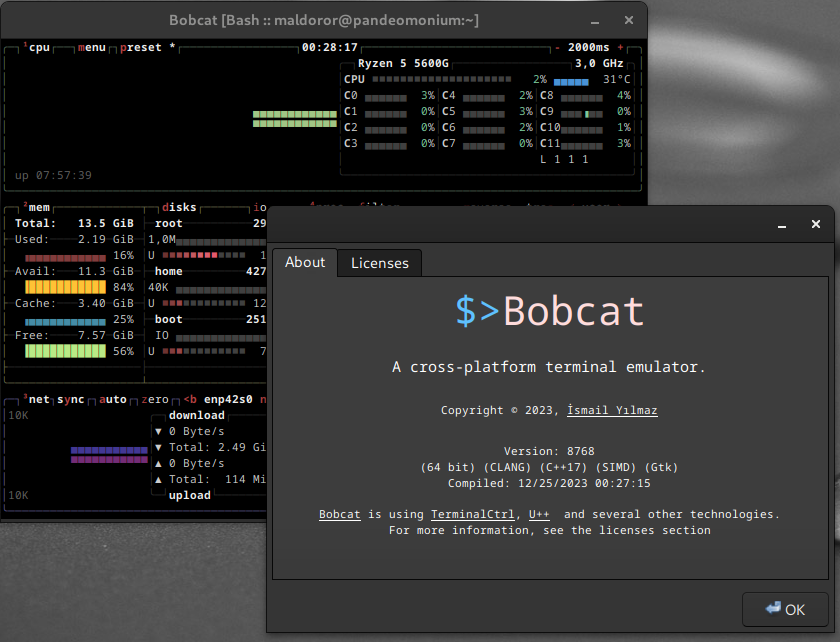

Bobcat on Windows

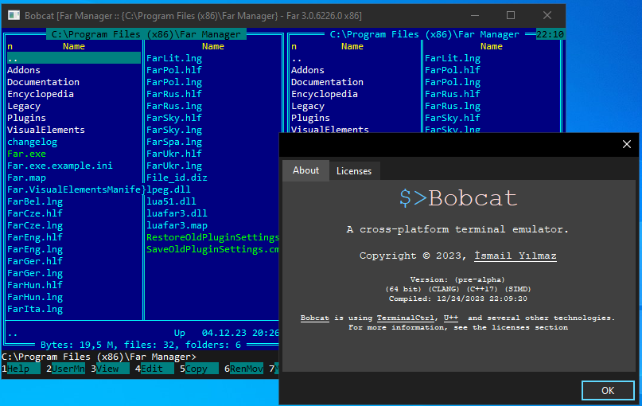

Bobcat, running zellij, with a background image of well..., a bobcat!

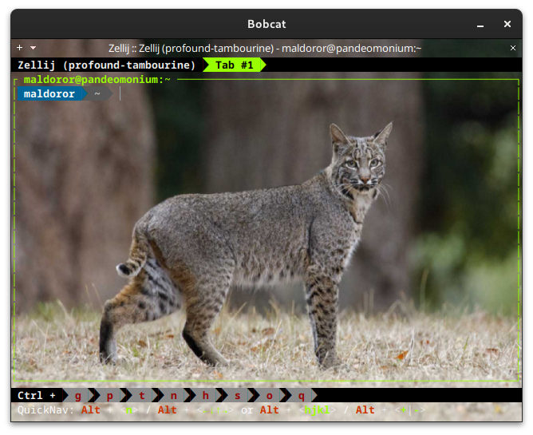

Bobcat, running yazi, in borderless mode on Linux.

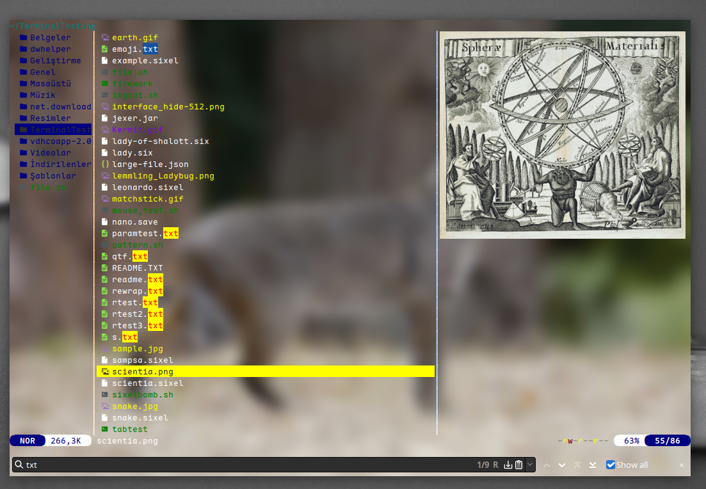

Bobcat, running yazi with image preview feature on Windows

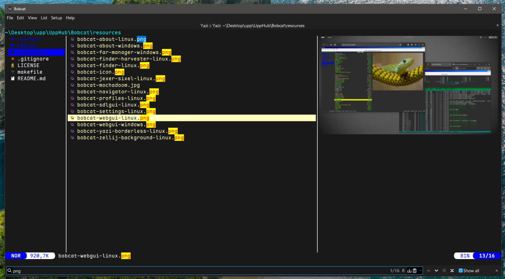

Bobcat, running Neovim on Windows

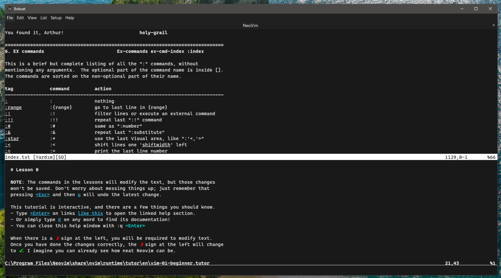

Split screen support (linux, zellij/neovim, btop)

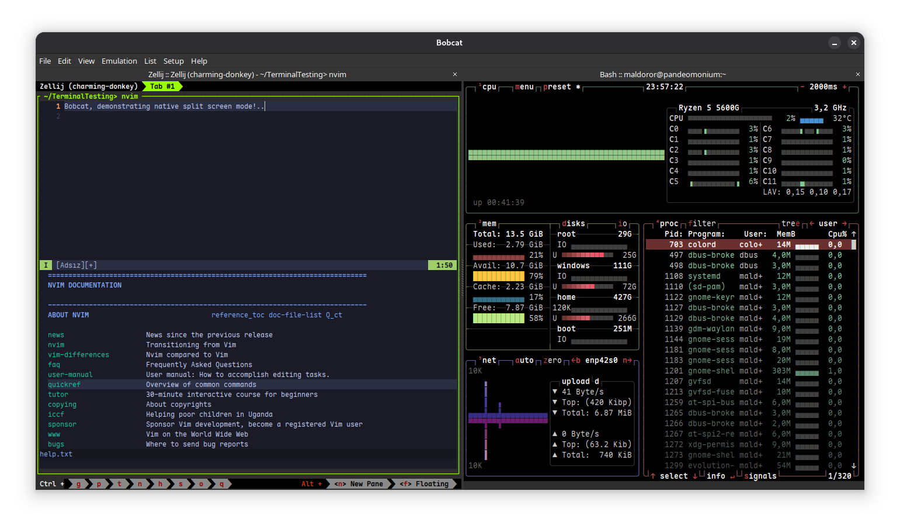

Multiple terminal profile support (linux, btop)

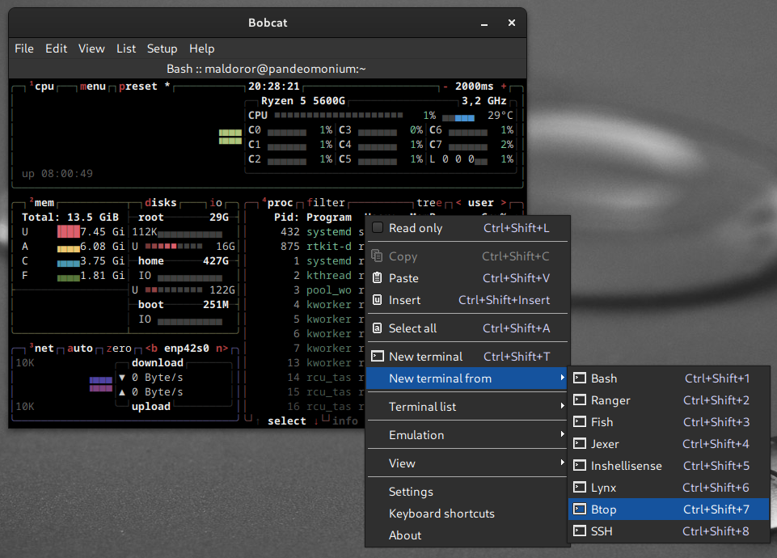

Inline images support (linux, jexer)

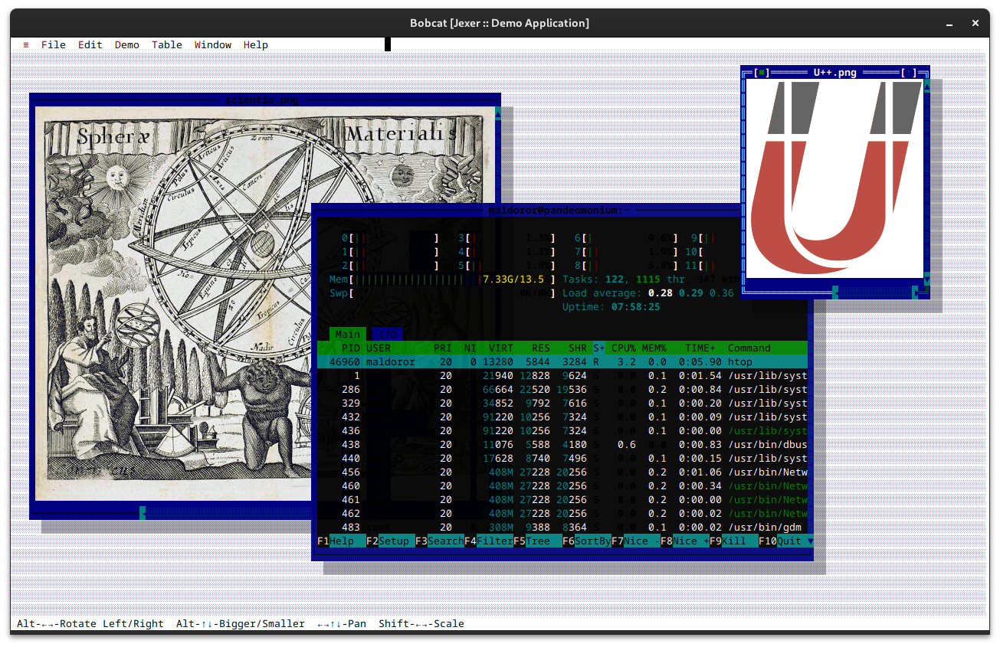

Navigator (linux)

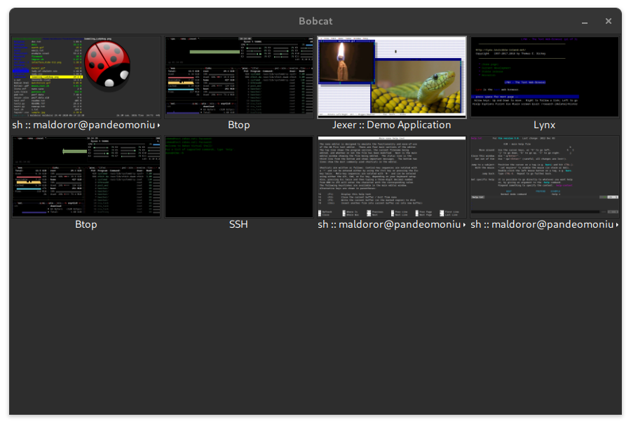

Finder, in regex-based search mode (linux)
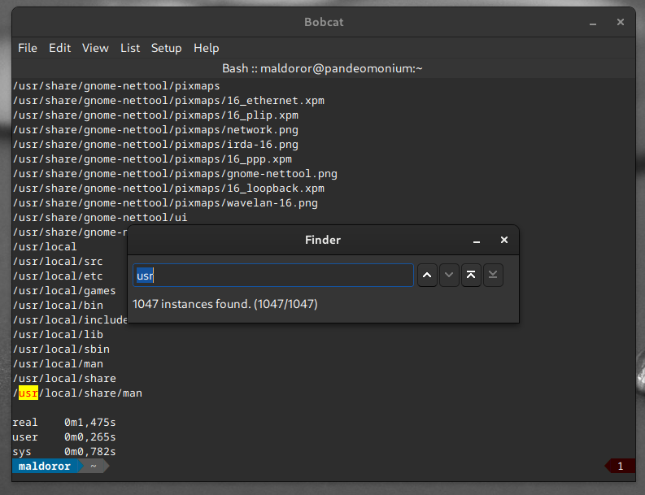

Harvester, harvesting 124660 URLs from the buffer, and mapping them into a csv file (linux)
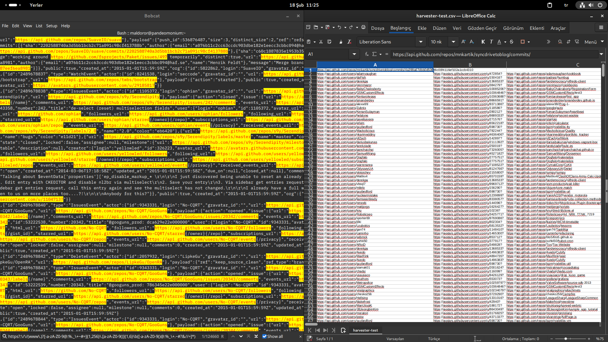

Settings windows (linux)

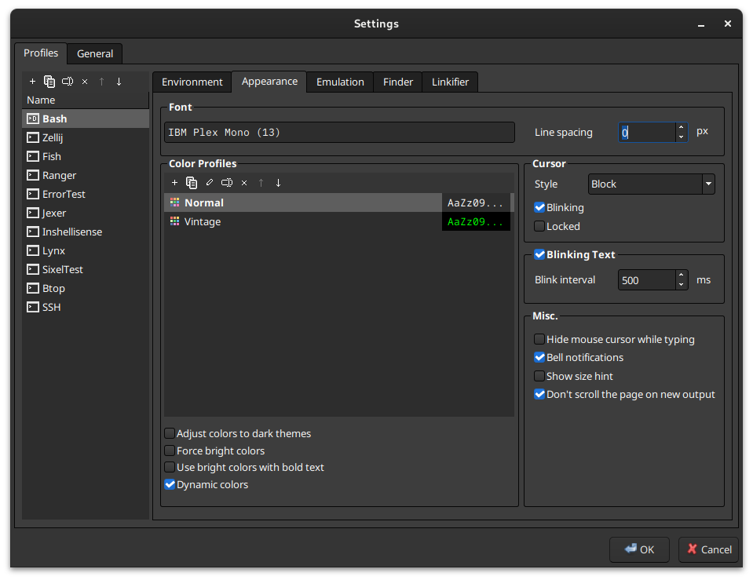

Far manager running on Bobcat (Windows 10)

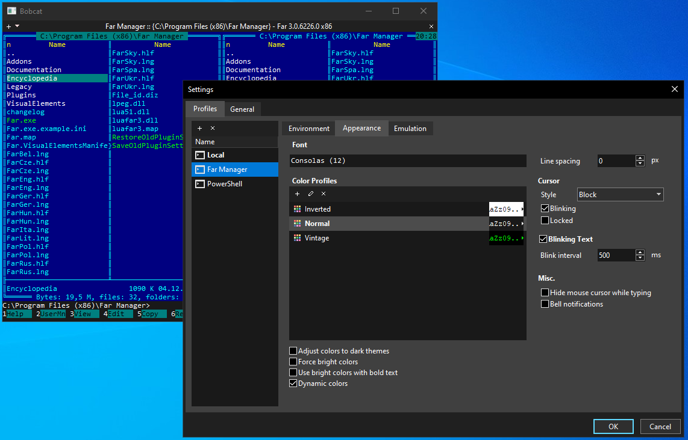


Bobcat deployed as a simple web server with access from web browsers (Linux)

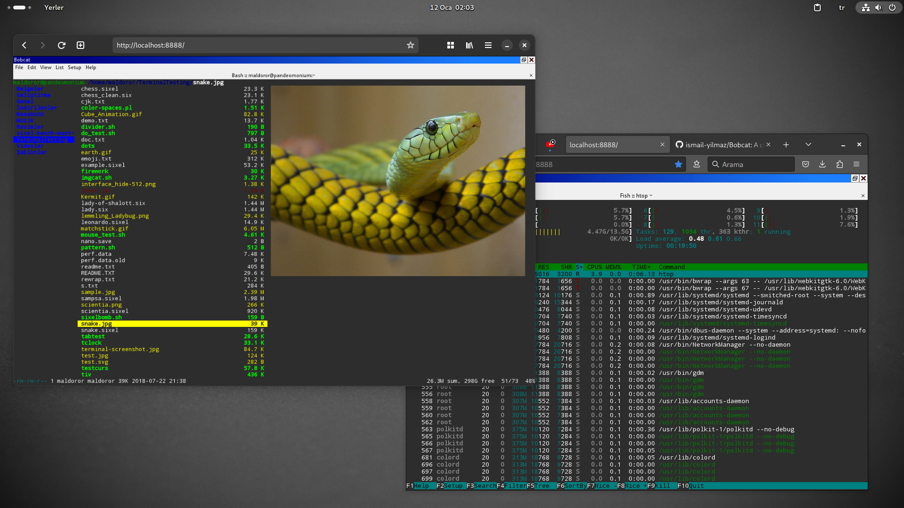

Bobcat deployed as a simple web server with access from web browsers (Windows)

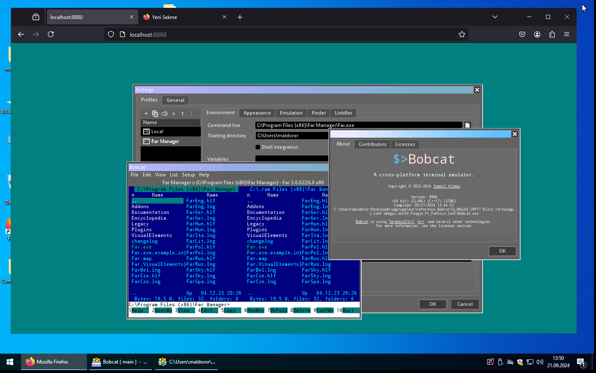

Bobcat running "headless" on SDL2 (GL) backend (Linux)

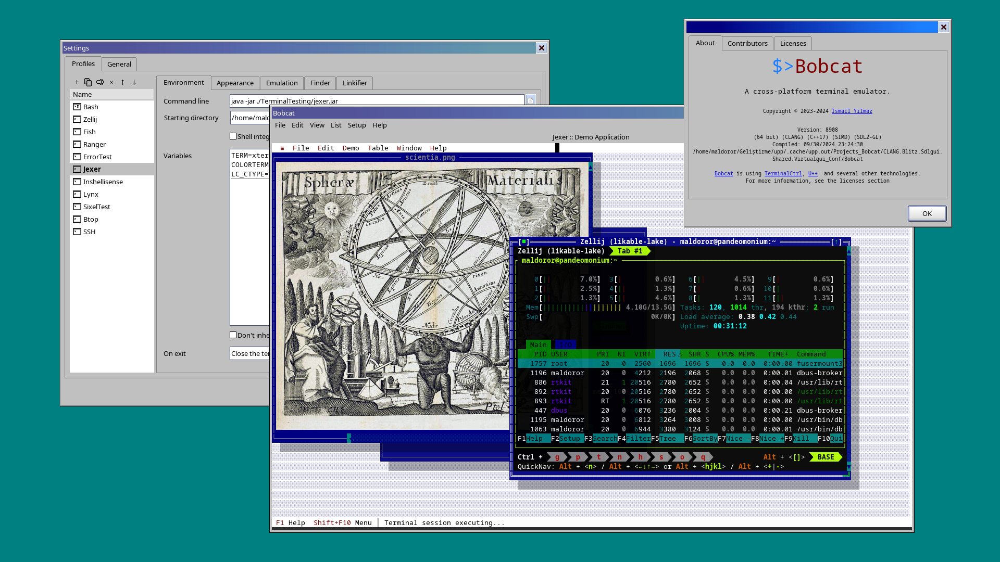


Doom, running on Bobcat, via [mochadoom](https://github.com/AutumnMeowMeow/mochadoom) (Linux)

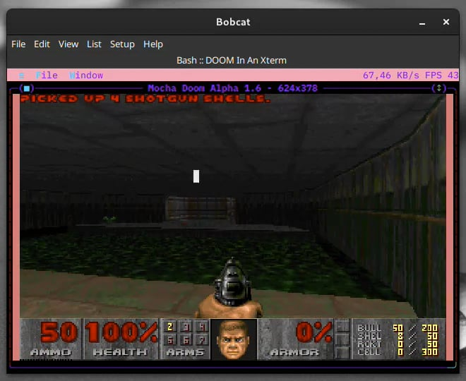

## [Videos](#Videos)

A short screencast of [@mmulet](https://github.com/mmulet)'s amazing [term.everything](https://github.com/mmulet/term.everything), running KDE Neon (a whole linux distro) in gnome-boxes on Bobcat!


https://github.com/user-attachments/assets/374395f1-5089-4433-a12a-4fb051c0a6e1


A very short [demonstration](https://vimeo.com/999236026) of Bobcat, running DOOM!

A very short [demonstration](https://vimeo.com/1003353669?share=copy) of finder/harvester and unicode character (emoji) input.

## [Acknowledgements](#Acknowledgements)

To be written...

## [License](#License)

Copyright (c) 2023-2025, İsmail Yılmaz

Bobcat is free software: you can redistribute it and/or modify it under the terms of the GNU General Public License as published by the Free Software Foundation, either version 3 of the License, or (at your option) any later version.

Bobcat is distributed in the hope that it will be useful, but WITHOUT ANY WARRANTY; without even the implied warranty of MERCHANTABILITY or FITNESS FOR A PARTICULAR PURPOSE. See the GNU General Public License for details. You should have received a copy of the GNU General Public License along with Bobcat. If not, see [gnu licenses](http://www.gnu.org/licenses/)

